# Twilio Video App React

## Twilio Video App React Default Room (Group) -

Room SID: RMc29f6660a9cf71fd044fbbf40da49da8

## Screenshots 1 Participant

### Audio Disabled

**Audio**

### Video Disabled

**Video**

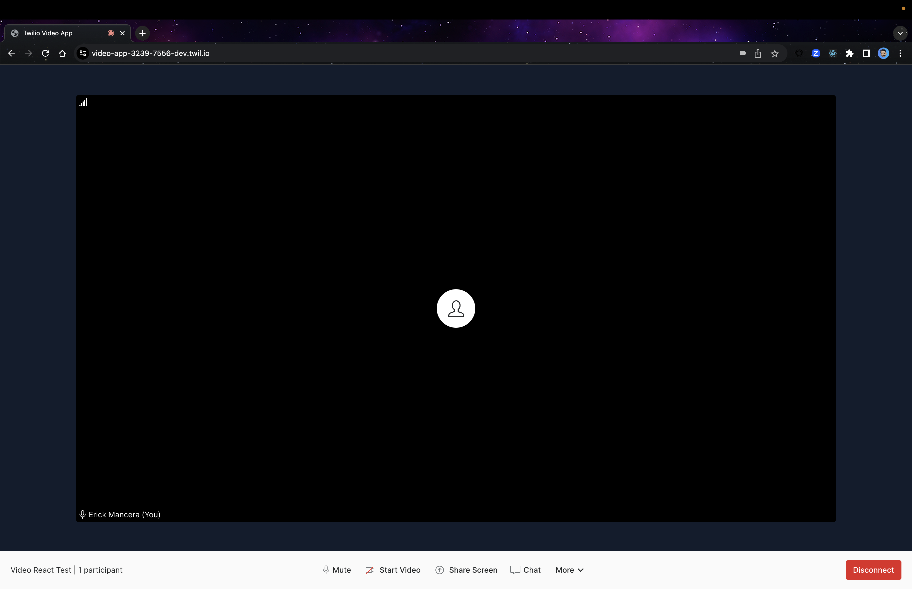

### Screen Sharing Enabled

### Speaker View Enabled

### Room Monitor Enabled

### Virtual Backgrounds Enabled

**Virtual Background**

**Blurred Background**

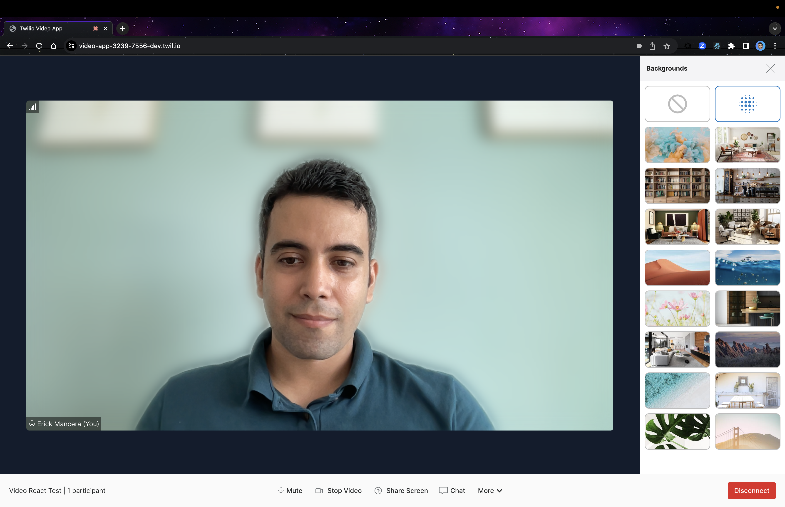

### Audio and Video Settings

Room SID: RM4396f69606c561f4d862ec01c10b7ea1

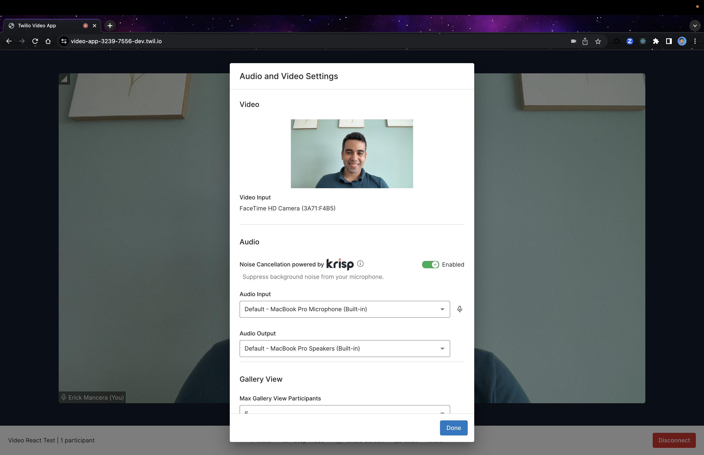

### Using Chat

### Recording

Recording SID: RTd2935fcdb99216a4f7ab666e89d17e8d

### About

## Twilio Video App React Default Room (Group) 

Room Sid: RMc29f6660a9cf71fd044fbbf40da49da8

### Group Room Default with a PSTN participant

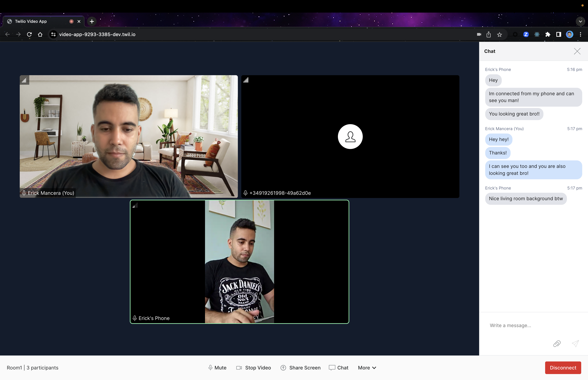

**Video Enabled And Audio Disabled**

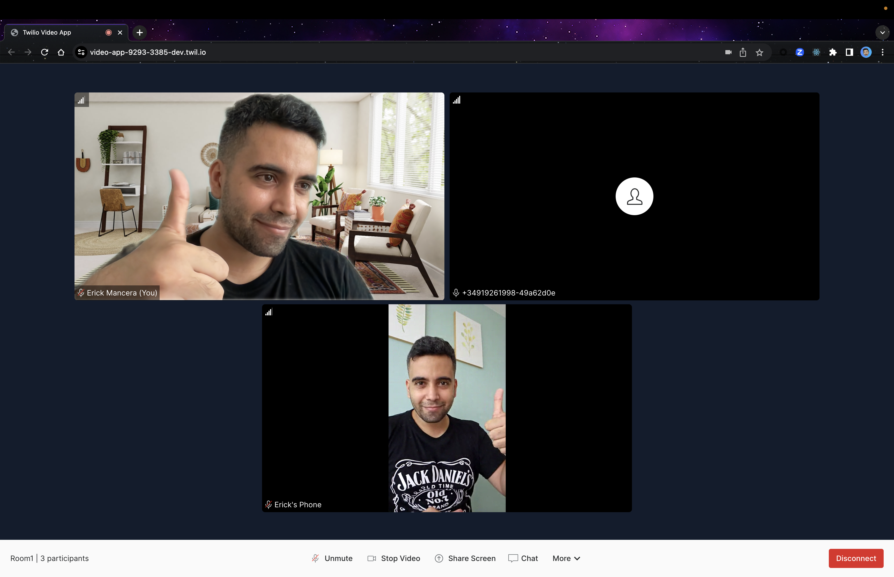

**Video Enabled Just for the Guest**

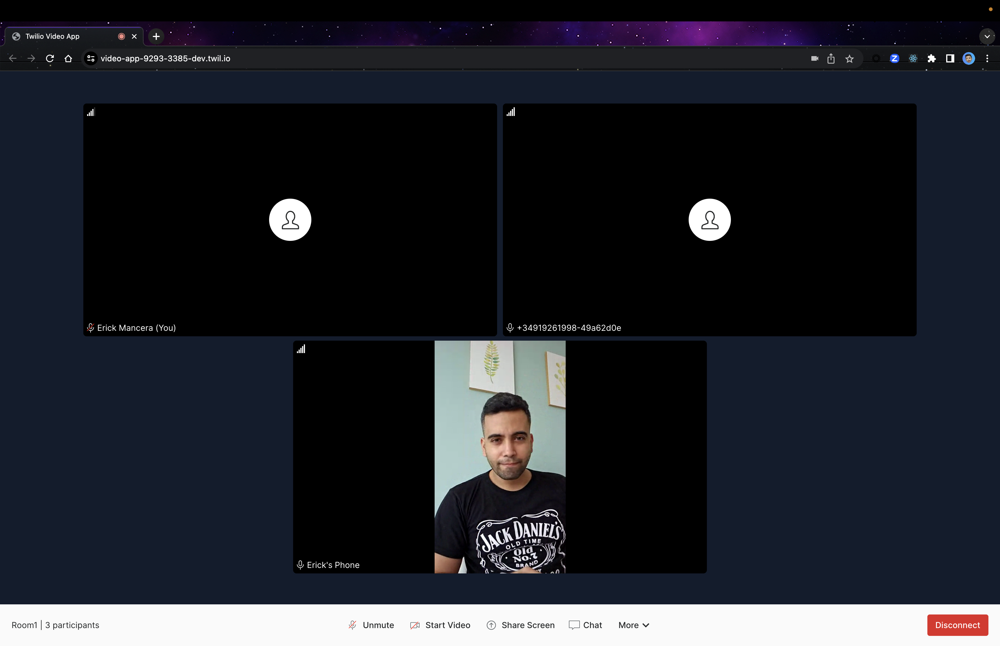

**Video Enabled Just for the Host**

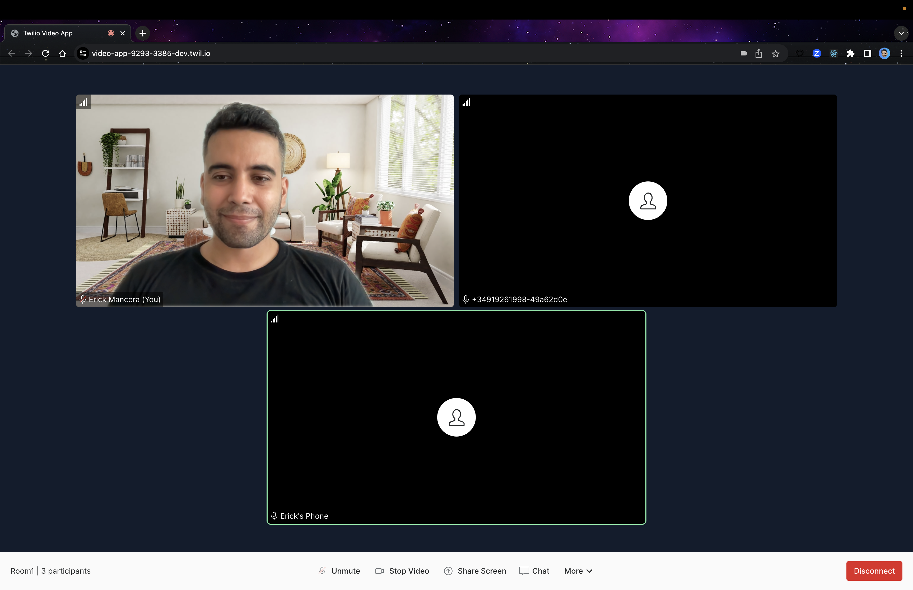

### Group Room Chat

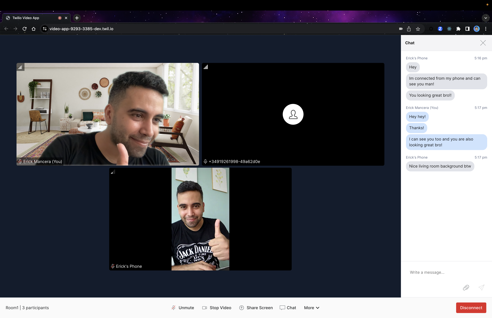

### Group Room Video Reconnecting

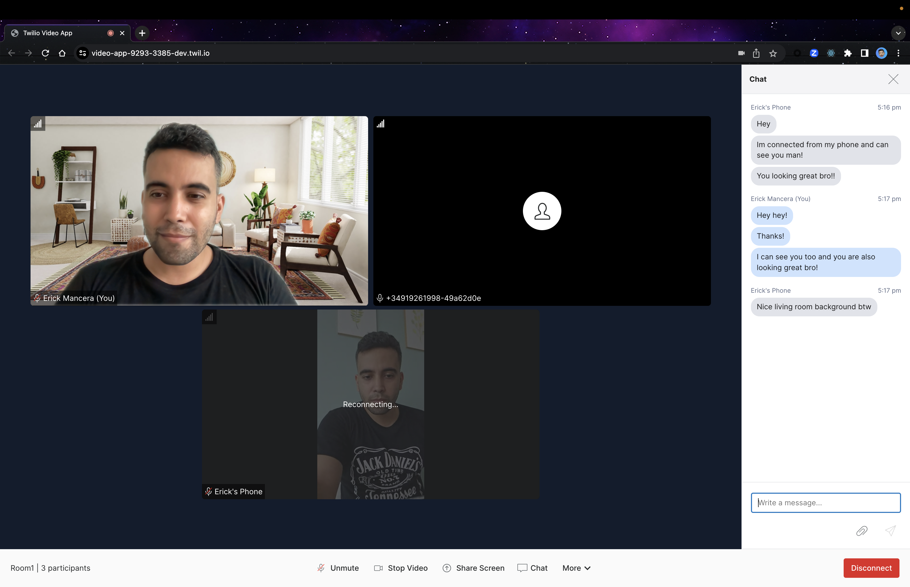

### Group Room Changed Default Devide From Guest

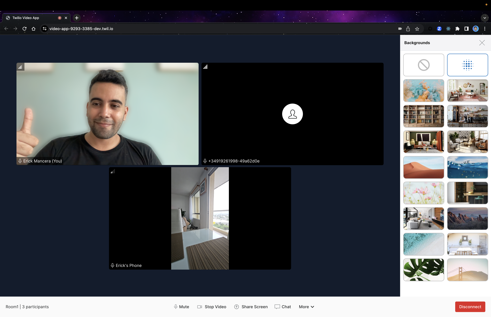

### Group Room Speaker View

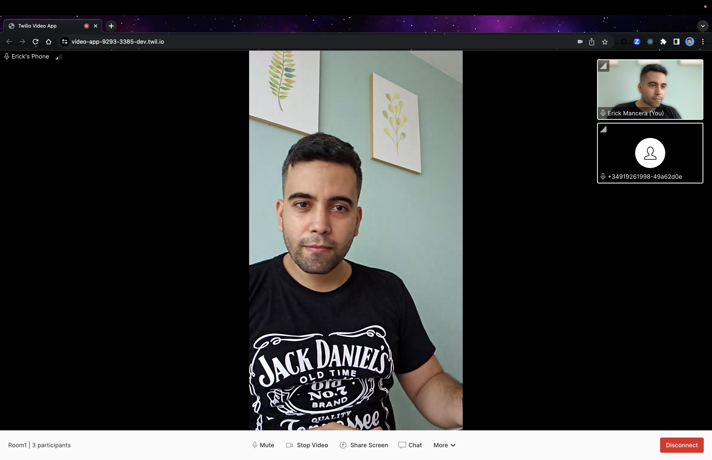

### Group Room Room Monitor

**Room Monitor Tab**

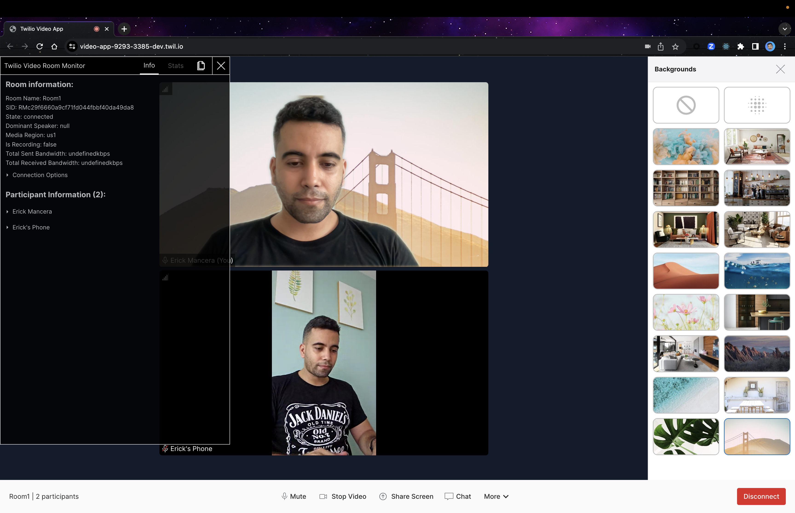

**Stats Tab**

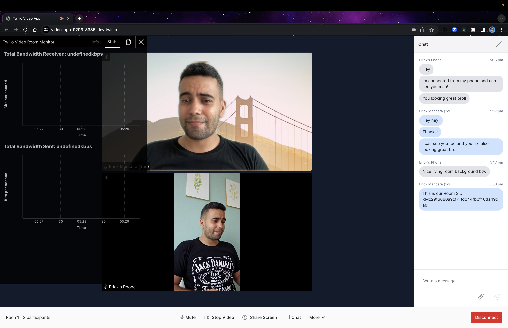

### Group Room Guest Disconnected

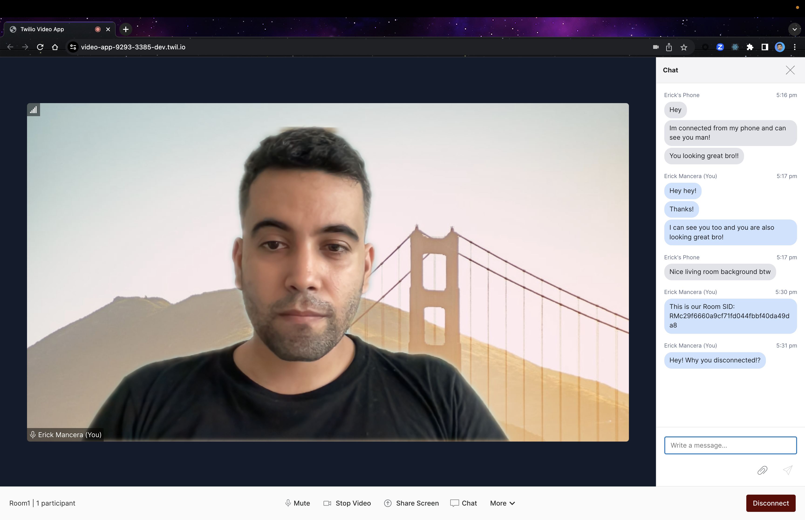

