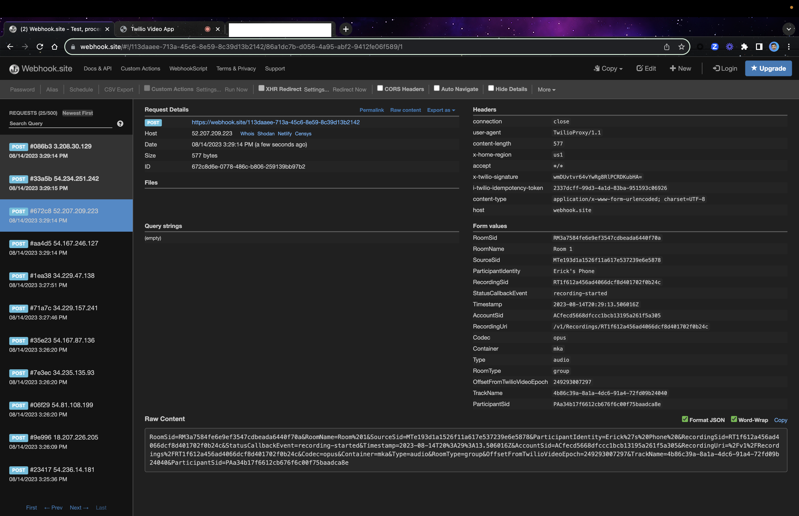
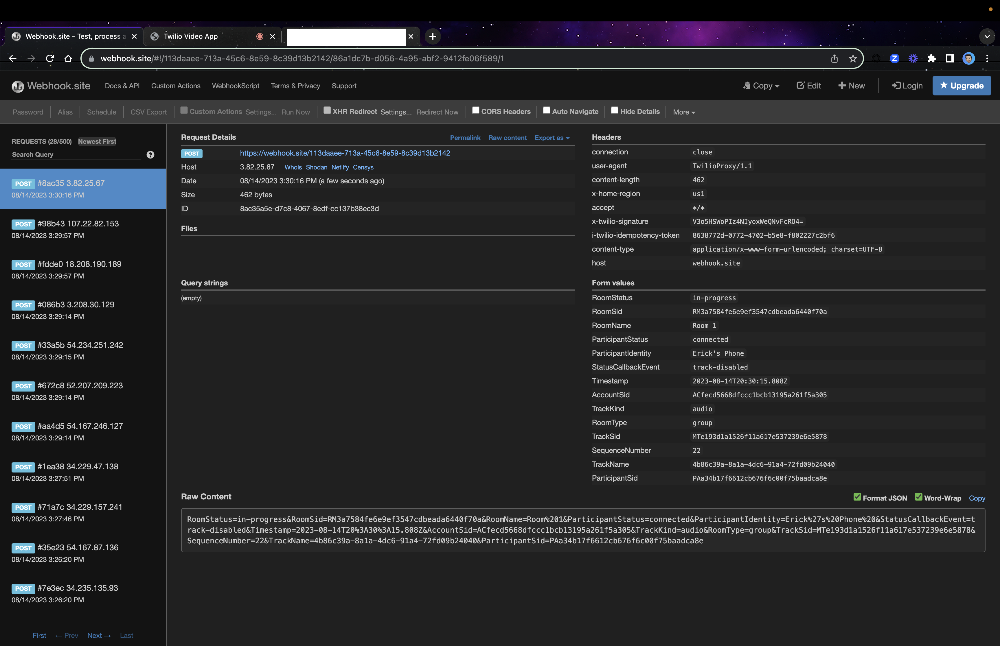
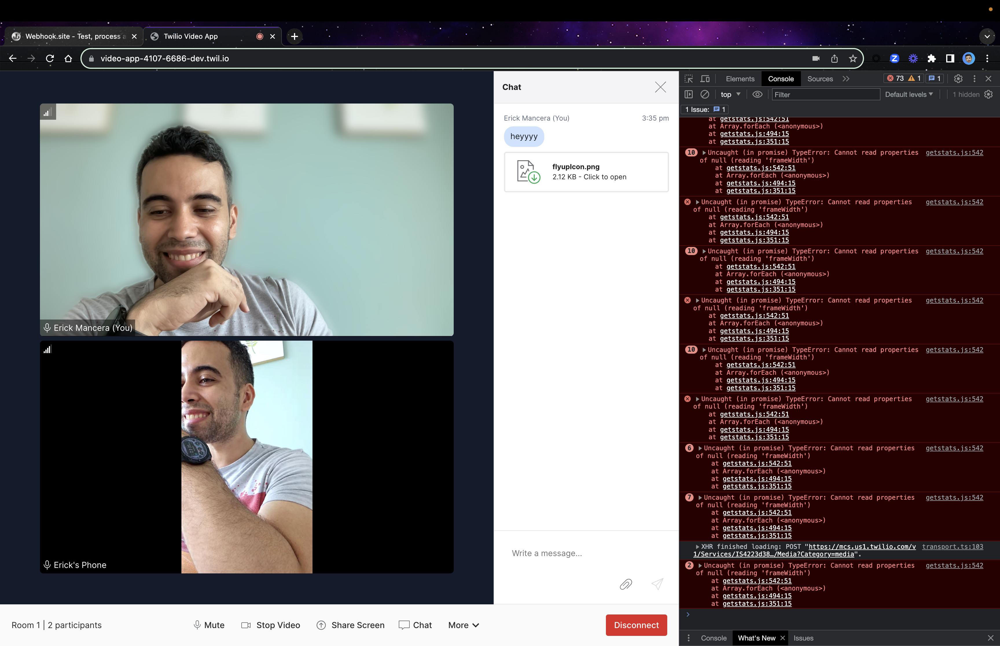

# Twilio Video App React

## Twilio Video App React Default Room (Group) -

Room SID: RMc29f6660a9cf71fd044fbbf40da49da8

## Status Callback for Room Created

## Status Callback When 1st Participant Connected

Participant connected

Video Track Added

Audio Track Added

## Audio Muted

Callback Event Audio Track Removed

Callback Event Audio Track Added 

## Video Disabled

Callback Event Video Track Removed

Callback Event Video Track Added

## Screen Sharing Enabled

Callback Event Video Track Added for Screen Share

Callback Event Video Track Removed for Screen Share

## Virtual Backgrounds Enabled

**Blurred Background**

## New Participant Joined

## Status Callback When 2nd Participant Connected

Participant connected

Video Track Added

Audio Track Added

## 2nd Participant Reconnecting

Callback Event Participant Disconnected

## Audio Disconnected

Callback Event Audio Disabled

## Video Disconnected

Callback Event Video Track Removed

## 2nd Participant Reconnected

Callback Event Audio Track Added

###Callback Event Video Track Added

## Recording

Recording SID: RTbdd746f712ed86b8c9540fdcec83b76d

Callback Event recording-started for Video Track for Participant 1

Callback Event recording-started for Audio Track for Participant 1

Callback Event recording-started for Video Track for Participant 2

Callback Event recording-started for Audio Track for Participant 2

## Disabled Audio and Video for participant 2 While Recodring

### Status Callback  Audio Track Disabled

### Status Callback  Video Track Removed

### Status Callback Video recording-completed

## Enabled Again Audio and Video for participant 2 While Recodring

### Status Callback  Audio Track enabled

### Status Callback  Video Track Added

###Status Callback Video recording-started

## Disabled Audio and Video for participant 1 While Recodring

### Status Callback  Audio Track Disabled

### Status Callback  Video Track Removed

### Status Callback Video recording-completed

## Enabled Again Audio and Video for participant 1 While Recodring

### Status Callback  Audio Track enabled

### Status Callback  Video Track Added

### Status Callback Video recording-started

## Speaker View Enabled

## Room Monitor Enabled

## About

### Using Chat

## Audio and Video Settings

## Host Disconnected and Meeting Ended

## Recording Completed After Meeting Ended

