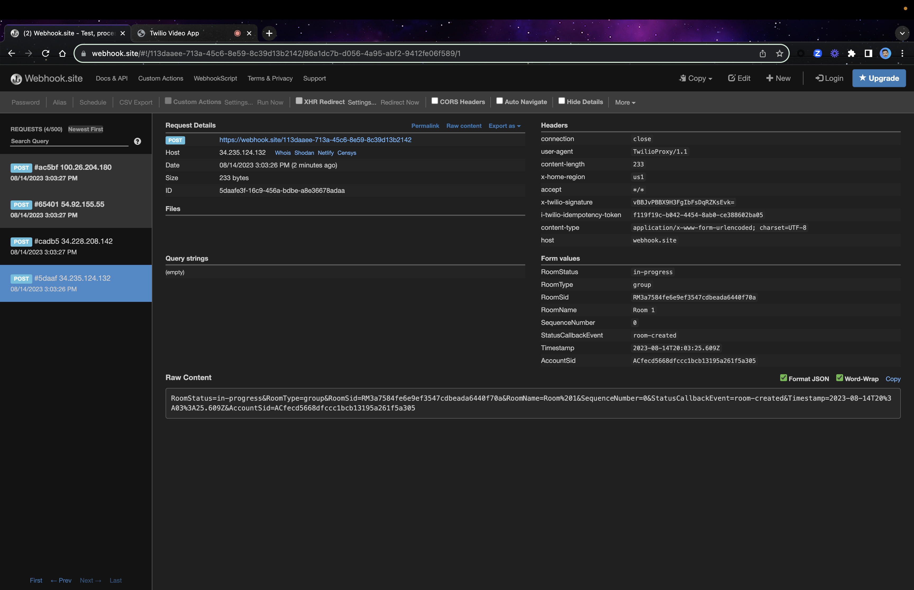
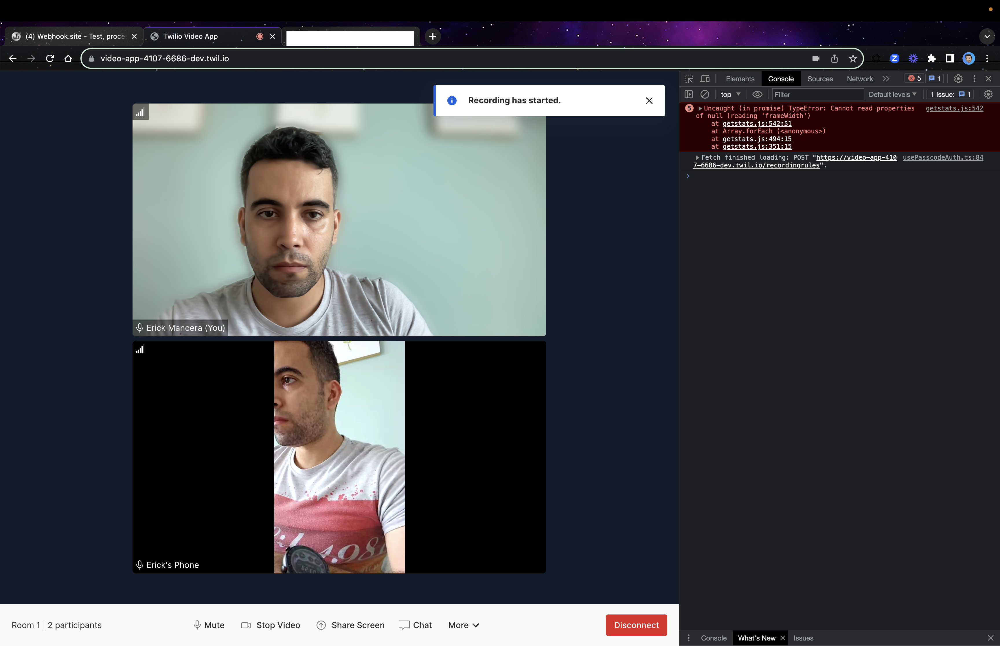
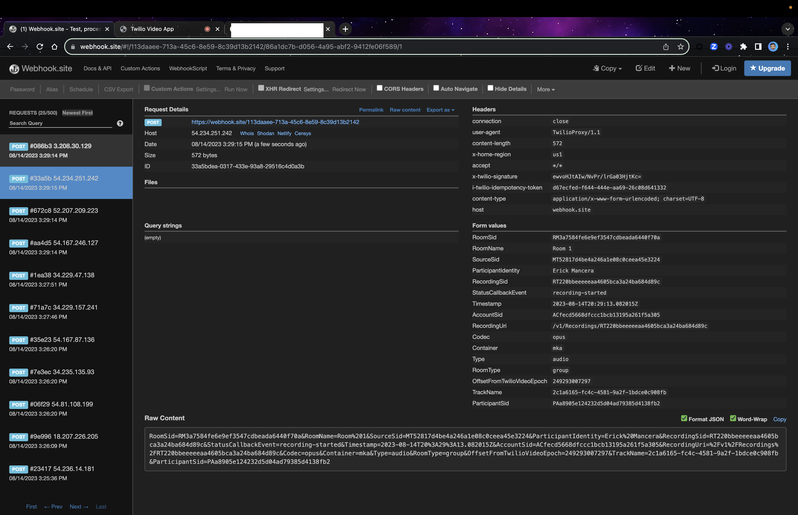

# Twilio Video App React

## Twilio Video App React Default Room (Group) -

Room SID: RMc29f6660a9cf71fd044fbbf40da49da8

##Status Callback for Room Created

##Status Callback When 1st Participant Connected

###Participant connected

###Video Track Added

###Audio Track Added

## Audio Muted

###Callback Event Audio Track Removed

###Callback Event Audio Track Added 

## Video Disabled

###Callback Event Video Track Removed

###Callback Event Video Track Added

## Screen Sharing Enabled

###Callback Event Video Track Added for Screen Share

###Callback Event Video Track Removed for Screen Share

## Virtual Backgrounds Enabled

**Blurred Background**

## New Participant Joined

##Status Callback When 2nd Participant Connected

###Participant connected

###Video Track Added

###Audio Track Added

##2nd Participant Reconnecting

###Callback Event Participant Disconnected

##Audio Disconnected

###Callback Event Audio Disabled

##Video Disconnected

###Callback Event Video Track Removed

##2nd Participant Reconnected

###Callback Event Audio Track Added

###Callback Event Video Track Added

## Recording

Recording SID: RTbdd746f712ed86b8c9540fdcec83b76d

###Callback Event recording-started for Video Track for Participant 1

###Callback Event recording-started for Audio Track for Participant 1

###Callback Event recording-started for Video Track for Participant 2

###Callback Event recording-started for Audio Track for Participant 2

##Disabled Audio and Video for participant 2 While Recodring

###Status Callback  Audio Track Disabled

###Status Callback  Video Track Removed

###Status Callback Video recording-completed

##Enabled Again Audio and Video for participant 2 While Recodring

###Status Callback  Audio Track enabled

###Status Callback  Video Track Added

###Status Callback Video recording-started

##Disabled Audio and Video for participant 1 While Recodring

###Status Callback  Audio Track Disabled

###Status Callback  Video Track Removed

###Status Callback Video recording-completed

##Enabled Again Audio and Video for participant 1 While Recodring

###Status Callback  Audio Track enabled

###Status Callback  Video Track Added

###Status Callback Video recording-started

## Speaker View Enabled

### Room Monitor Enabled

### Audio and Video Settings

Room SID: RM4396f69606c561f4d862ec01c10b7ea1

### Using Chat

### About

## Twilio Video App React Default Room (Group) 

Room Sid: RMc29f6660a9cf71fd044fbbf40da49da8

### Group Room Default with a PSTN participant

**Video Enabled And Audio Disabled**

**Video Enabled Just for the Guest**

**Video Enabled Just for the Host**

### Group Room Chat

### Group Room Video Reconnecting

### Group Room Changed Default Devide From Guest

### Group Room Speaker View

### Group Room Room Monitor

**Room Monitor Tab**

**Stats Tab**

### Group Room Guest Disconnected

