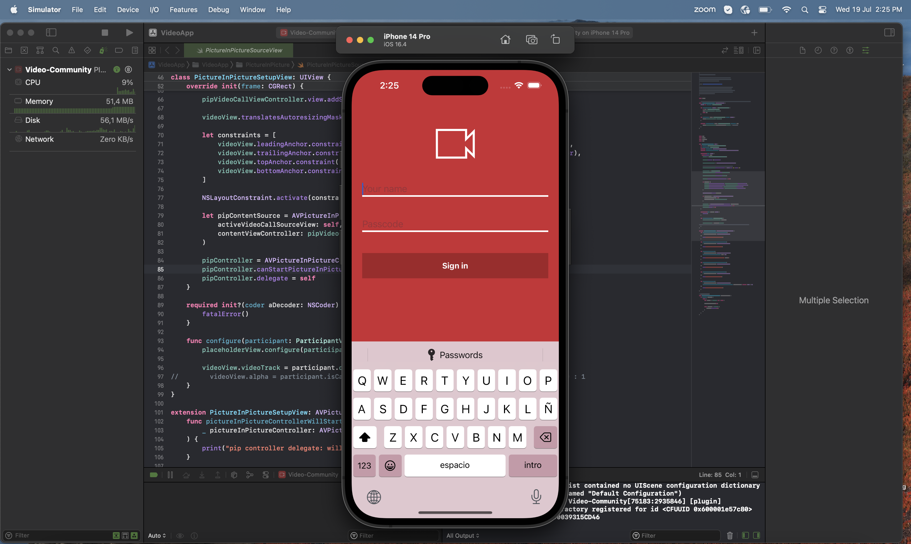
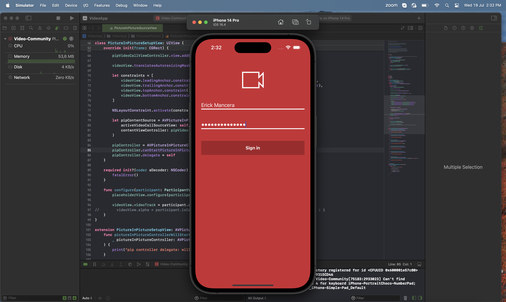
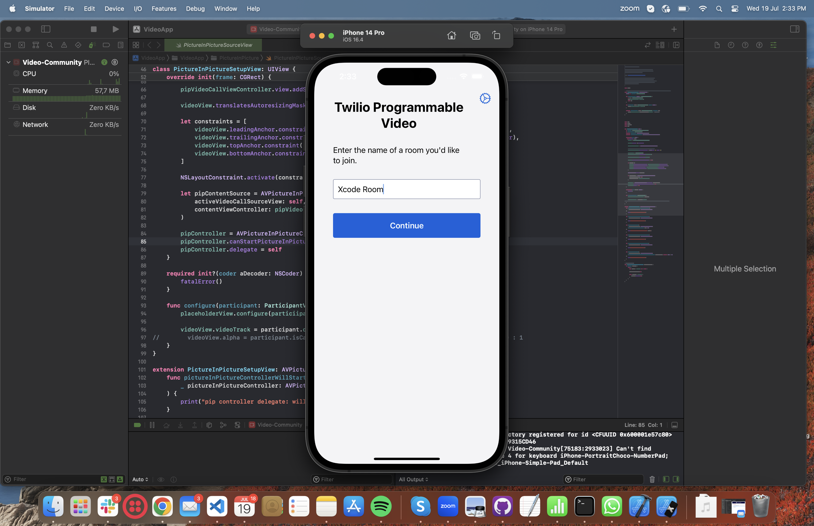
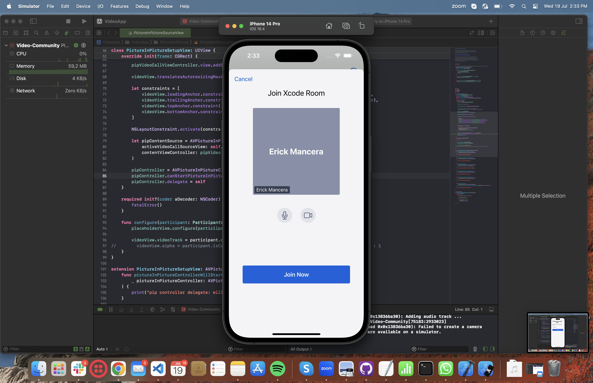
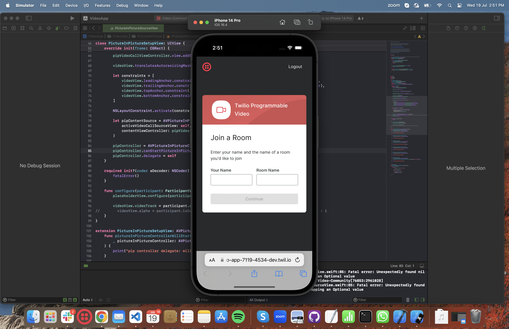
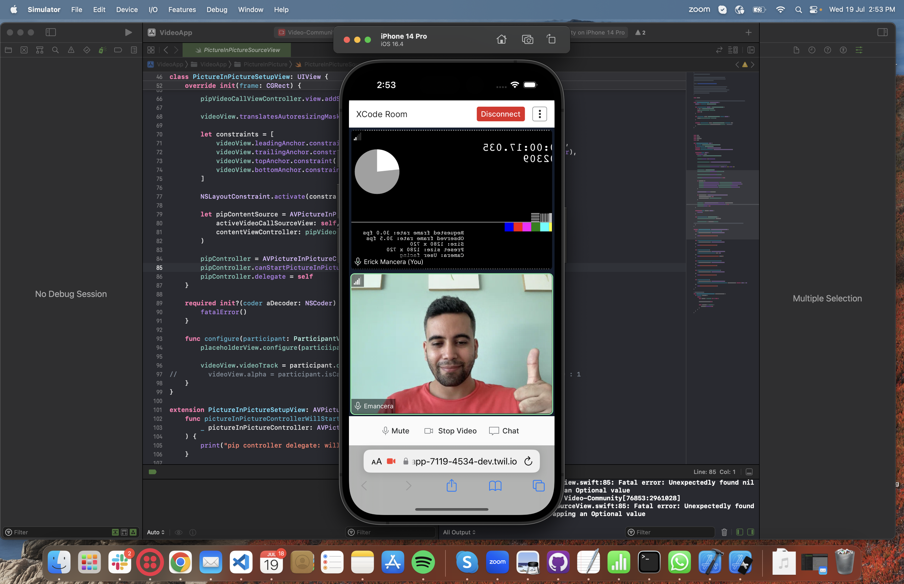

# Xcode App Simulation


## Generating a Passcode

```

emancera@PMX4JP ~ % twilio rtc:apps:video:deploy --authentication passcode --override        
deploying app... done
Passcode: 964 057 7119 4534
Expires: Wed Jul 26 2023 12:11:46 GMT-0500
Room Type: group
Edit your token server at: https://www.twilio.com/console/functions/editor/ZSefee4a4043a57b41458cbe8945cf7339/environment/ZE5430e65a45cd4fcd07aeaf9dddeaf3e2/function/ZHb91a146cee6a5612e23602cc957b4e01 
```

## Twilio Video App Running on Emulator





## Login Screen Using Passcode





## Twilio Video App Running After Login 





## Joining Room 





## Joining React App Room Using Browser





## Sharing Video Using React App On Browser


