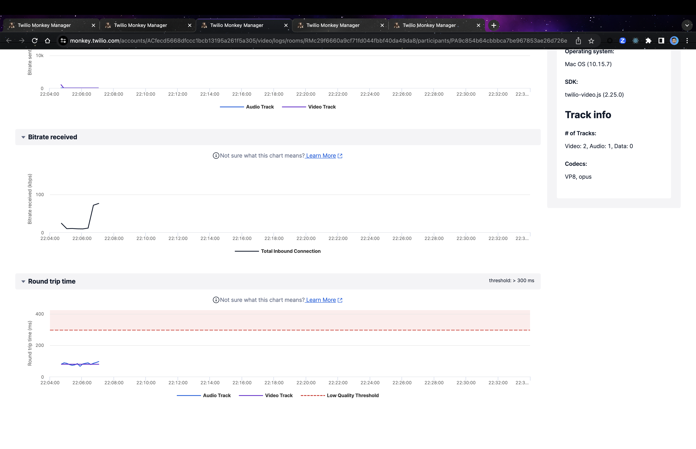
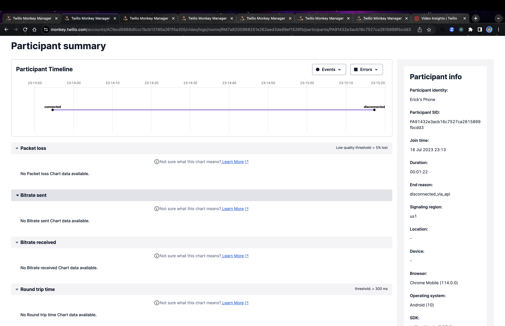

# Ouput Diferences Between Group and P2P Rooms

## Group Room Output

Room SID: RMc29f6660a9cf71fd044fbbf40da49da8

##Screenshot

In the Group Room output we can see data captured by the Twilio servers like Audio Tracks and Data Tracks shown on the "Round trip time" Chart.

## P2P Room Output

Room SID: RM7a8200968251e262aed3de89ef1526fb

##Screenshot

In the P2P room there is no data captured by the twilio server and this happens because the data doesn't traverse Twilio's servers, it also means that Twilio has limited visibility into the content of the communication. In a P2P Room The Twilio servers just facilitate the initial signaling and establishment of the P2P connection, but once the connection is established, the data transmission occurs directly between the participants' devices.
